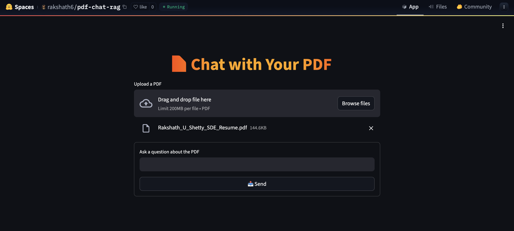

# 📄 PDF Chatbot — Minimal RAG App using Streamlit + FAISS + Mistral

A clean, fast **PDF-based RAG chatbot** built with SentenceTransformers, FAISS vector search, and OpenAI’s Mistral-7B — all inside a beautiful Streamlit UI.

> ✅ Built with: `Streamlit`, `FAISS`, `SentenceTransformers`, `OpenAI`, `PyPDF`, `Mistral 7B`


---

## 📸 Preview



---

## 🧠 Features

- 📄 Upload and chat with **PDFs**
- 🔍 Finds relevant **chunks** using FAISS + embeddings
- 💬 Ask any question in **natural language**
- 🧬 Embeds text using `MiniLM-L6-v2`
- 🧠 Answers via **OpenAI’s Mistral-7B**
- 🎨 Custom chat bubble UI in Streamlit

---

## 🚀 Getting Started

### 🔧 Prerequisites

- Python 3.9+
- Get your API key from [OpenAI](https://platform.openai.com/api-keys)

---

### 🖥️ Local Installation

```bash
# 1. Clone this repo
git clone https://github.com/rakshath66/chat-with-your-pdf.git
cd chat-with-your-pdf

# 2. Create virtual environment
python -m venv venv
source venv/bin/activate  # or venv\Scripts\activate

# 3. Install dependencies
pip install -r requirements.txt

# 4. Add your API key in .env
echo "OPENAI_API_KEY=your_openai_key" >> .env

# 5. Launch the app
streamlit run src/streamlit_app.py
````

---

## 🔐 Environment Variables

Create a `.env` file (or set in Streamlit Secrets):

```
OPENAI_API_KEY=your_openai_key
```

If you're using **Streamlit Cloud/ HuggingFace**, paste this into **Settings → Secrets**:

```toml
OPENAI_API_KEY = "sk-..."
```

---

## 💬 Example Prompts

* *"Summarize the full document."*
* *"What is the main conclusion in page 3?"*
* *"List all key entities mentioned."*
* *"Who is the author and when was this written?"*

---

## 📁 Project Structure

```
chat-with-your-pdf/
├── .env
├── requirements.txt
├── src/
│   └── streamlit_app.py
└── images/
    └── ui.png
```

---

## 🤝 Contributing

We welcome contributions! Here's how you can help:

### ✅ To Contribute:

1. Fork this repository
2. Clone your fork:
   `git clone https://github.com/Rakshath66/Chat-With-Your-PDF.git`
3. Create a new branch:
   `git checkout -b feature/my-feature`
4. Make your changes and commit:
   `git commit -m "Add: your message here"`
5. Push to your branch:
   `git push origin feature/my-feature`
6. Open a Pull Request with a description of your changes

🔍 Please write clean code, add docstrings if needed, and test your features!

---

## 📄 License

MIT © [Rakshath U Shetty](https://github.com/rakshath66)

```text
Permission is hereby granted, free of charge, to any person obtaining a copy
of this software... [rest of MIT license]
```

---

## ⭐ Star this project if you like it!

It helps others discover it, and motivates me to build more free AI tools.
Also, feel free to open issues, request features, or contribute.

---

### 🧑‍💻 Built by [Rakshath U Shetty](https://github.com/rakshath66)

* Open source forever
* Designed for learning, research, and practical use
* Reach out via issues or PRs — ideas welcome!

---


## 🛣️ Next Steps — Roadmap

---

### ✅ Phase 1: Basic RAG PDF Chatbot ✅ *(Done)*

* ✅ Upload PDF
* ✅ Chunk + embed with MiniLM
* ✅ FAISS vector store
* ✅ OpenAI + Mistral response

---

### 📁 Phase 2: Multi-PDF Support

* 📚 Support multiple PDFs at once
* 🔍 Search across all PDFs in vector DB
* 🧩 Track source chunk in response

---

### 🧠 Phase 3: Chunk Highlight + Source Tracking

* ✨ Show which PDF chunk was used
* 🔎 Highlight sentence or paragraph
* 📎 Add page numbers in answer

---

### 🧠 Phase 4: Simple Memory (Session-based)

* 🧠 Let chatbot remember previous Q/A per PDF session
* 🔁 Keep conversation thread for 1 session

---

### ⚙️ Phase 5: Backend API Support

* 🔧 Wrap logic into `FastAPI` or `Flask`
* 🔁 Expose `/ask` endpoint with PDF + query
* 🛠️ Use as an **API for other frontends**

---

### 🌐 Phase 6: URL + Website Reader (optional)

* 📰 Add `summarize_url` support
* 🌍 Upload a link → extract → chat like PDF

---

````markdown
---

## 🤝 Contributing

Contributions, issues, and feature requests are welcome!

If you'd like to contribute:

1. 🍴 Fork this repo
2. 🔧 Create a new branch (`git checkout -b feature-name`)
3. 💻 Make your changes
4. ✅ Test thoroughly
5. 📩 Submit a pull request

Please ensure your code follows best practices and includes helpful comments/documentation if needed.

---

### 📜 Code Commit Style

Follow [Conventional Commits](https://www.conventionalcommits.org/en/v1.0.0/):

- `feat:` new feature
- `fix:` bug fix
- `docs:` documentation update
- `refactor:` code refactor
- `style:` UI or formatting
- `chore:` maintenance tasks

Example:
```bash
git commit -m "feat: added multi-pdf upload support"
```

---

### 🧪 Testing

Make sure your code:

* Doesn’t break the main app
* Works on local Streamlit
* Follows a consistent UI/UX style

---

### 🙏 Thank You

Every contribution makes this project better. Whether it's a typo fix or a new feature — you're appreciated!


```

Let me know if you want:
- `LICENSE` file (MIT version)
- A matching `.env.example` file
- `demo/screenshot.png` placeholder
- `contributing.md` file

All of this helps boost your open-source visibility!
```

